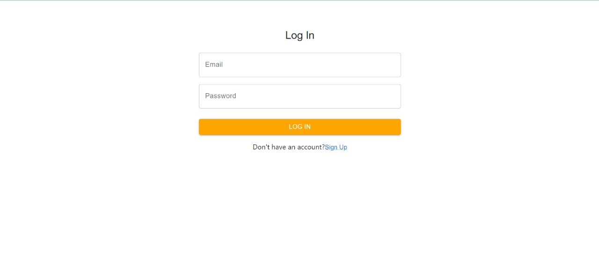
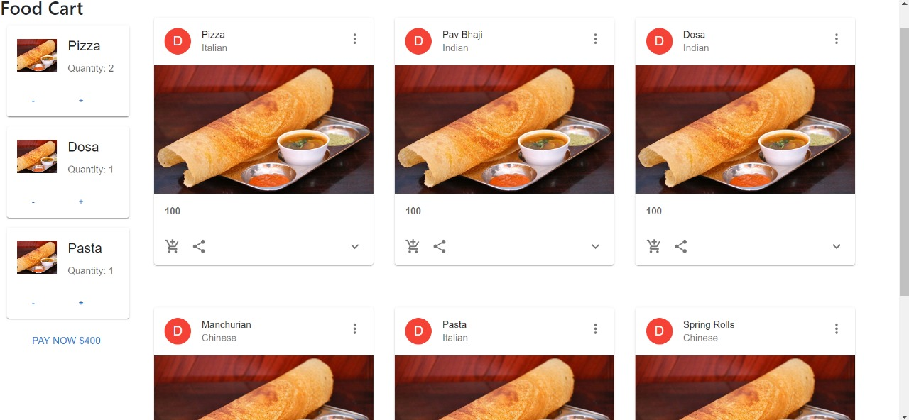
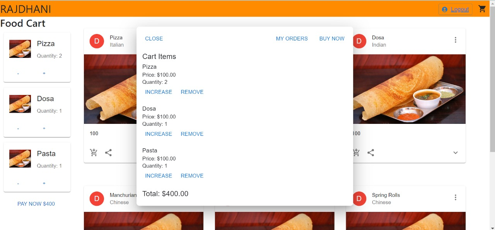
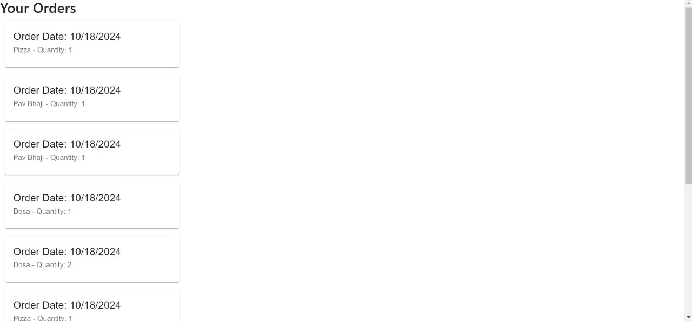

Here's a revised `README.md` that includes a section to showcase the working of your project using photos:

---

# Restaurant Order Management System

This project is a web application designed to manage orders in a restaurant setting.

## Features

- **User Authentication:** Secure user login and registration.
- **Order Management:** Place new orders, view order history.
- **Menu Display:** Display menu items with details.
- **Responsive Design:** User-friendly interface for various devices.

## Technologies Used

- **Frontend:** React.js, Material-UI
- **Backend:** Node.js, Express.js, MongoDB
- **Authentication:** JWT (JSON Web Tokens)

## Getting Started

### Prerequisites

- Node.js and npm installed
- MongoDB Atlas account (for cloud database)

### Installation

1. **Clone the repository**

   ```bash
   git clone https://github.com/BAnSsal/Restaurent_Order.git
   cd Restaurent_Order
   ```

2. **Install dependencies**

   ```bash
   cd frontend
   npm install

   cd ../backend
   npm install
   ```

3. **Set up environment variables**

   - Create `.env` files in both `frontend` and `backend` directories.
   - Add necessary environment variables.

4. **Start the applications**

   ```bash
   # Start frontend (React)
   cd frontend
   npm start

   # Start backend (Node.js)
   cd backend
   npm start
   ```

5. **Access the application**

   - Frontend: `http://localhost:3000`
   - Backend: `http://localhost:5000`

## Screenshots

### Login Page


### Menu Display


### Place an Order


### Order History


## Contributing

Contributions are welcome! Fork the repository, make your changes, and submit a pull request.

## License

This project is licensed under the MIT License. See the [LICENSE](./LICENSE) file for details.

---

This version includes a "Screenshots" section at the end to show the application's interface. Make sure to upload the images to your repository and update the file paths accordingly.
